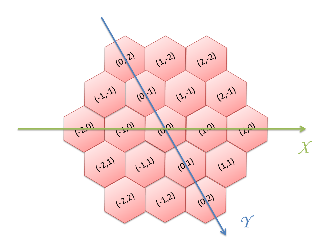
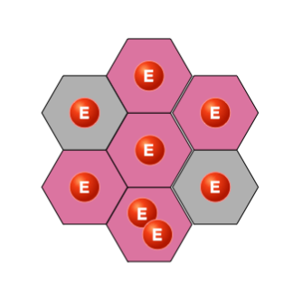

# クイックルール（ルール概要）

## ゲームの概要

プレイヤーはロボットを操作して、開拓・建造・戦闘を通して小惑星を開発する。
敵プレイヤーに負けないよう小惑星を開発しよう！

## ゲームの目的

土地の開拓や建物の建造によって得られる得点を、他のプレイヤーよりも多く獲得する。
得点の計算方法は後述する。

## フィールド

フィールドは正六角形である。
1辺が7個の小さい正六角形からなり、127マスの小さい正六角形で構成される。

  

フィールドは4種類のマスから構成されており、ロボットの移動や建物の建造の可否が変わる。

* __荒野 (Wasteland)__

  初期状態のマス。
  ロボットが荒野に移動すると、その荒野は所有者の開拓地に変化する（これを占領と呼ぶ）。

* __開拓地 (Settlement)__

  プレイヤーが占領したマス。
  ロボットが存在する開拓地に建物を建造できる。
  建造を行うと基地に変化する。
  敵対するプレイヤーの開拓地も占領できる。

* __基地 (Base)__

  プレイヤーが建物を建造した後のマス。
  ロボットは敵対するプレイヤーの基地に移動できない。

* __穴 (Hole)__

  フィールドに15個程度存在する障害物。
  ロボットが穴に移動すると、穴に落ちるため、それ以降移動できなくなる。
  後述する橋を建造すると、そのマスのロボットが移動できるようになる。

## フィールドの初期状態

ゲーム開始時、プレイヤーの初期位置およびフィールドの穴の配置が決定される。
プレイヤーの初期位置と穴の位置は、各プレイヤーが点対象になるようにランダムに決定される。
初期位置には、ロボットが毎ターン5体生成される大規模工場が配置される。

## ターン処理

毎ターン、複数箇所のロボットの移動もしくは1箇所での建造が行える。
例えば、移動した後の建造はエラーとなり実行されない。

## ロボットの移動

毎ターン、各ロボットを1ターンに1マス動かすことができる。
すでにロボットが存在するマスに移動させると、ロボット数が加算される。
敵対するロボットが存在するマスに移動させると、数が多い方のロボットが差し引き分残る。
そのマスは残ったロボットの所有者の開拓地となる。

## 資源

建物の建造に必要である。
荒野および開拓地のみに存在する。
初期状態では各荒野に1個ずつ存在する。

## 建物

開拓地と穴には建物を建造することができ、建造が行われたマスは基地になる。
なお、穴には橋のみ建造できる。
建物の建造には資源とロボットが必要である。

* 資源

  図（資源供給の図）のように、建造を行うマスおよび周囲1マスの自分の開拓地に存在する資源の合計が、建造に必要な資源数以上である必要がある。
  建物を建造しても周囲の資源は消えないが、建造したマスは基地になるので資源が消える。

  

* ロボット

  建造を行うマスに存在するロボットが、建造に必要なロボット数以上である必要がある。
  資源とは異なり、ロボットは消滅する。

### 建物一覧

ゲームに登場する建物は以下の通りである。
建物の隣の数字はその建物に必要な資源とロボットである。

#### ロボット系

* __ロボット製造機 (Initial)__ (建造不可)

  ターン開始時にロボットを5体生成する。

* __小型ロボット製造機 (Robot Maker)__ 資源 4 / ロボット 30

  毎ターン開始時に、ロボット2体を生成する。

* __攻撃塔 (Attack)__ 資源 5 / ロボット 25

  毎ターン、図（攻撃等の図）のように、周囲2マスに対して攻撃を行う。
  攻撃した各マスについて、敵ロボットの数を2減らす。
  
#### 資源系

* __掘削機 (Excavator)__ 資源 4 / ロボット 20

  隣接マスの自分の開拓地の資源が1個増える。

#### 移動系

* __橋 (Bridge)__ 資源 4 / ロボット 15

  穴に橋を建造すると、ロボットは穴から別のマスへ移動できるようになる。

#### 得点系

* __家 (House)__ 資源 4 / ロボット 10

  特に効果を持たない

* __街 (Town)__ 資源 9+ / ロボット 10

  周囲1マスの自分の開拓地を家に変更する。
  街を建設する際に周囲に存在するマテリアルの数-9の得点を建物と別に獲得する。
  
## ゲームの終了

以下の条件のいずれかを満たしたとき、ゲーム終了となる。

1. いずれかのプレイヤーが100点を獲得する
1. 200ターンが経過する

以下のルールに基づいて得点を計算し、最も得点の高いプレイヤーを勝者とする。

1. 開拓地 → 1マスにつき1点
1. 基地 → 1マスにつき3点
1. 街による加算点(建設時に獲得)

2人以上が同点で1位の場合、手番の遅いプレイヤーを勝者とする。

## AI作成上のルール
### ゲーム本体とAIプログラムの動作プロセス
1. ゲーム本体がゲームを初期化
1. ゲーム本体がゲーム状態をAIプログラム1に入力
1. AIプログラム1はプレイヤー名を出力
1. ゲーム本体がゲーム状態をAIプログラム2に入力
1. AIプログラム2はプレイヤー名を出力
1. ゲーム本体がゲーム状態をAIプログラム3に入力
1. AIプログラム3はプレイヤー名を出力
1. ゲーム本体がゲーム状態をAIプログラム1に入力
1. AIプログラム1は1ターン目のコマンド列を出力
1. ゲーム本体がゲーム状態をAIプログラム2に入力
1. AIプログラム2は1ターン目のコマンド列を出力
1. ゲーム本体がゲーム状態をAIプログラム3に入力
1. AIプログラム3は1ターン目のコマンド列を出力
1. ゲームが終了するまで手順8-13を繰り返す

### 入力仕様
以下の形式でAIに対するフィールドの情報が標準入力を介して与えられる。

    START
    ターン番号 最大ターン番号 プレイヤーのID
    フィールドの幅 タイルの数
    タイル1のx座標 y座標 所有者のID ロボットの数 資源数 地形情報 建物
    タイル2のx座標 y座標 所有者のID ロボットの数 資源数 地形情報 建物
    ...
    タイルnのx座標 y座標 所有者のID ロボットの数 資源数 地形情報 建物
    EOS

タイルの所有者がいない場合は「所有者のID」が-1、タイルが穴である場合は「建物」がholeになる。
地形情報とは、4種類のマス情報(荒野(wasteland)、開拓地(settlement)、基地(base)、穴(hole))のことである。

### プレイヤー名の出力方法
SampleAIというプレイヤー名を出力したい場合は、標準出力へ以下の内容を出力する。
ただし、末尾には改行コードを付与すること。

    SampleAI

### コマンド列の出力方法

座標(2, 3)に位置するロボット2体を左に動かしてターンを終了する場合は、標準出力へ以下の内容を出力する。
ただし、末尾には改行コードを付与すること。

    move 2 3 l 2
    finish

以下のようにfinishを複数回出力した場合は、次のターンのコマンド内容が街を建設するコマンドになる。
なお、複数回のbuildコマンドおよびmoveとbuildコマンドの混合は認められないため、家を建設するコマンドは無視される。

    move 2 3 l 2
    finish
    build 1 2 town
    build 2 3 house
    finish

### ゲーム開始時の制限時間
各プレイヤーは5000msの間にゲームの初期状態を受け取ってプレイヤー名を決定しなければならない。
5000msを超えた場合はプレイヤー名が"nanashi"になり失格となる。
なお、ゲームの初期状態には開始時のマップ情報が含まれているため、名前を決める際に戦略を練っても良い。

### ゲーム開始後の制限時間
各プレイヤーは1ターンにつき1000msの間に全てのコマンドを入力しなければならない。
1000ms以内に入力が終了しなかった(finishコマンドが入力されなかった)場合、1ゲーム以内で合計5000msまでの時間超過が認められる。
超過時間が合計で5000msを超えた場合、以降の入力は全てfinishコマンドのみと見なされ、一切コマンド入力ができなくなる。

